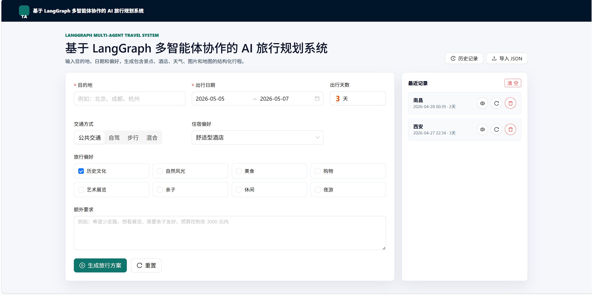
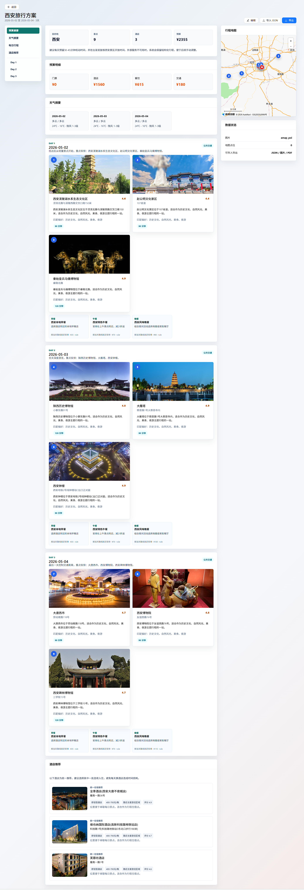

# 基于 LangGraph 多智能体协作的 AI 旅行规划系统

## 项目描述

基于 Vue3 + TypeScript + FastAPI 重构智能旅行规划系统，采用 LangChain / LangGraph 多智能体协作工作流。  
系统围绕目的地解析、景点检索、天气、酒店、美食、图片补全、地图数据构建和结果校验进行节点化编排，并通过 Pydantic 统一状态与响应结构。  
集成高德地图、Unsplash 和兼容 OpenAI 协议的 LLM，支持外部 API 失败降级、历史记录、JSON 导入导出、地图 Marker 展示及长页面 PNG/PDF 导出。  
针对图片跨域和导出丢图问题实现后端图片代理与前端 dataURL 转换，提升旅行方案展示与分享的稳定性。


## 技术栈

- 前端：Vue 3、TypeScript、Vite、Ant Design Vue、AMap JSAPI Loader、html2canvas、jsPDF、localStorage。
- 后端：FastAPI、Pydantic、LangChain、LangGraph、loguru、httpx、python-dotenv。
- Agent 与外部服务：LangGraph 状态图编排、兼容 OpenAI 协议的 LLM、Gaode 高德地图 Web API、Unsplash 图片 API。
- 工程能力：前后端分离、环境变量配置、结构化日志、Pydantic 数据契约、外部 API 失败降级、JSON 导入导出、长页面 PNG/PDF 导出。


## 效果展示
用户输入目的地和出行天数，交通方式，住宿偏好，旅行偏好等信息。并且支持查看历史记录，导入之前的旅行方案 JSON 文件。



系统生成旅行方案，包含每日景点、酒店、美食推荐，并在地图上展示景点位置和行程路线。用户可以导出 PNG 图片或 PDF 文件。



## 目录结构

```text
travel_agent/
├── backend/
│   ├── app/
│   │   ├── agents/          # LangGraph 工作流与状态
│   │   ├── api/             # FastAPI 路由
│   │   ├── core/            # 日志等基础设施
│   │   ├── models/          # Pydantic 模型
│   │   └── services/        # 高德、图片、LLM 服务
│   ├── image_temp/          # PNG/PDF 导出时按需生成的图片缓存
│   └── requirements.txt
├── frontend/
│   ├── src/components/      # TripMap 地图组件
│   ├── src/utils/           # localStorage 历史记录
│   ├── src/views/           # 首页、结果页
│   └── package.json
└── logs/
```

## 环境变量配置

后端在 `backend/.env` 或项目根目录 `.env` 中读取：

```env
AMAP_API_KEY=你的高德Web服务Key
UNSPLASH_ACCESS_KEY=你的Unsplash Access Key
LLM_API_KEY=你的LLM Key
LLM_BASE_URL=https://api.openai.com/v1
LLM_MODEL_ID=gpt-5.4-mini
LOG_LEVEL=INFO
APP_DEBUG=false
APP_HOST=0.0.0.0
APP_PORT=8000
```

前端在 `frontend/.env` 中读取：

```env
VITE_API_BASE_URL=http://localhost:8000
VITE_AMAP_WEB_JS_KEY=你的高德Web端JS API Key
VITE_AMAP_SECURITY_JS_CODE=你的高德安全密钥
```

缺少外部 Key 时后端仍可启动：POI、天气、图片和 LLM 会走降级数据，保证接口不崩溃。

### 启动后端

```bash
cd backend
python -m pip install -r requirements.txt
python run.py
```

API 文档：`http://localhost:8000/docs`

### 启动前端

```bash
cd frontend
npm install
npm run dev
```

前端地址：`http://localhost:5173`

## LangGraph 工作流

工作流核心节点：

1. 输入解析与参数标准化
2. 动态目的地坐标解析
3. 景点搜索
4. 天气查询
5. 统一酒店推荐
6. 美食推荐
7. 图片补全
8. 行程规划
9. 地图数据构建
10. 结果校验与格式化
每个节点都通过 Pydantic 模型校验输入输出，并把异常写入状态中的 `errors`，外部服务失败时使用本地降级数据继续生成方案。

## 历史记录方案

当前采用前端 `localStorage` 保存最近 20 条记录，字段包含：

- 用户输入参数
- 生成时间
- 目的地
- 出行天数
- 完整旅行方案


## 导入导出

结果页支持：

- 导出 JSON：包含完整结构化 `TripPlan`，可再次导入恢复。
- 导入 JSON：支持导入纯 `TripPlan`、`{ data: TripPlan }` 或本系统导出的 JSON。
- 导出图片 / PDF：只导出中间行程内容列，不导出左侧导航和右侧地图；导出前等待所有图片加载，并把景点/酒店图片通过 `/api/poi/image-proxy` 下载到 `backend/image_temp/<目的地-日期>/` 后转成 dataURL，避免第三方图片 CORS 污染 Canvas；PDF 支持长页面分页。
